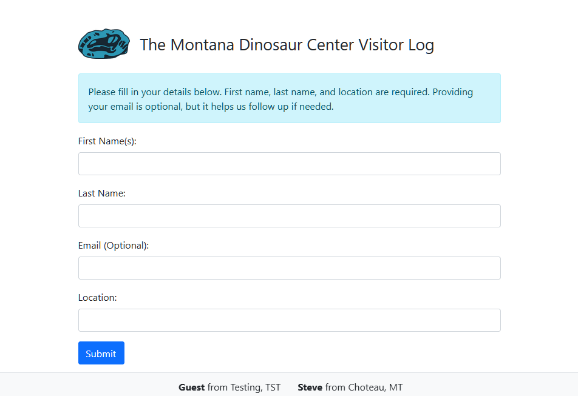

# Museum Visitor Guestbook

A simple Flask-based guestbook application designed for an internal museum kiosk. This application collects visitor details (first name(s), last name, email, location, and an optional comment) while dynamically revealing the comment field only after the required fields are filled out with at least 3 characters each. The app includes basic input validation, profanity filtering using a custom banned words list, and logging for easier troubleshooting. It uses SQLite for data storage and is containerized with Docker and Docker Compose for easy deployment on an intranet.



## Features

- Dynamic Form Behavior:
The comment field is hidden by default and only revealed when the first name, last name, and location fields each contain at least 3 characters.
- Input Validation:
Ensures required fields (first name, last name, and location) are filled and validates email format (if provided).
Uses a profanity filter loaded from en.txt to prevent inappropriate language in comments.
- Logging:
Logs key events and validation errors for debugging and monitoring.
- SQLite Database:
Stores guest entries locally, with persistence ensured by mounting a Docker volume.
- Containerized Deployment:
Uses Docker and Docker Compose for a production-ready environment with Gunicorn as the WSGI server.
- Configurable Template:
The application’s title and logo can be dynamically configured via environment variables without rebuilding the image.

### Project Structure

``` bash
kiosk-guestbook/
├── app.py                          # Main Flask application code
├── Dockerfile                      # Dockerfile for building the image
├── docker-compose.yml              # Docker Compose configuration (see deployment instructions below)
├── example.docker-compose.yml      # Example Docker Compose file for deployment
├── example.env                     # Example environment variable file
├── entrypoint.sh                   # Entrypoint script that processes templates and starts Gunicorn
├── en.txt                          # Profanity list file (one banned word per line)
├── README.md                       # Project documentation
├── requirements.txt                # Python dependencies (Flask, Gunicorn, etc.)
├── scripts/
│   └── guestbook_export.py         # Script to export guest entries to CSV (e.g., for Mailchimp)
├── static/
│   └── images/
│       └── logo.png                # Default logo for display in the application (configurable via env variable)
└── templates/
    └── index.html.template         # HTML template for the guestbook page (processed to index.html at runtime)
```

## Getting Started

### Prerequisites

- Docker
- Docker Compose
- Optionally, Portainer for GUI-based container management

## Running the Application

Before proceeding, you’ll need to have the example configuration files. These files—example.docker-compose.yml and example.env—are included in the repository. You can download them by cloning the entire repository:

```bash
git clone https://github.com/tmdinosaurcenter/kiosk-guestbook.git
cd kiosk-guestbook
```

If you don’t wish to clone the entire repo, you can also download the two files individually from GitHub. Once you have them, follow the steps below.

### Method 1: Using Docker on the CLI

1. Copy Example Files:
From the project root, copy the example files:

``` bash
cp example.docker-compose.yml docker-compose.yml
cp example.env .env
```

2. **Edit the `.env` File (Optional)**

Modify `.env` to customize settings such as `SITE_TITLE`, `LOGO_URL`, `PORT`, etc.

3. **Start the Application**

Run the following command to pull (or use) the pre-built image and start the container:

`docker-compose up -d`

This command starts the container in detached mode, mounts the persistent volume for the SQLite database, and uses your environment variable settings.

4. **Access the Application**

Open your browser and navigate to `http://<your-server-ip>:8000` (or the port specified in your `.env` file).

### Method 2: Running in Portainer

1. **Copy Example Files**

```bash
cp example.docker-compose.yml docker-compose.yml
cp example.env stack.env
```

*Note*: Portainer expects the environment file to be named stack.env rather than .env

2. **Edit `docker-compose.yml`**
In the `docker-compose.yml` file, update the environment file reference from `.env` to `stack.env`

3. **Deploy via Portainer**

   - Log in to Portainer and navigate to the "Stacks" section.
   - Create a new stack and upload or paste your modified docker-compose.yml along with the `stack.env` file.
   - Deploy the stack. Portainer will use stack.env for the environment variables.

4. **Access the Application:**
Once deployed, open your browser and navigate to http://<your-server-ip>:8000 (or your specified port) to view the application.

## Logging and Monitoring

- The application uses Python's built-in logging module.
- Key events, such as database initialization, form submissions, and validation errors, are logged.
- View logs with:

`docker-compose logs -f`

## API Access

Access the API endpoint to export guest entries by navigating to:

`http://your-server-ip:8000/guests/api`

This endpoint can be integrated with on-prem automation tools like n8n.

## Additional Notes

- **Intranet-Only Deployment**
This application is designed for internal use only and is not exposed to the public internet.

- **Database Persistence**
The SQLite database is stored in a Docker volume (guestbook_data), ensuring that data persists even if containers are rebuilt.

- **Production Considerations**
The app runs with Gunicorn as a production-ready WSGI server. Adjust worker counts and resource limits as needed based on your server’s specifications.

## License

This project is licensed under the [MIT License](LICENSE).
